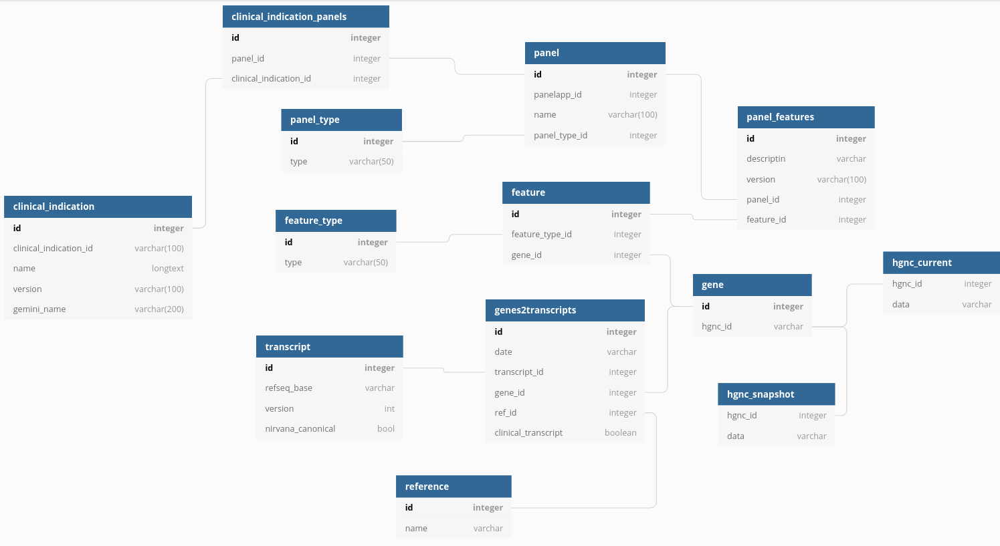

## What does this do?

Handles operations with the panel_database.

## What are typical use cases for this?

Generating panelapp dumps, generating django importing dumps, generating sql dumps.

Checking database data, checking tests against Test directory, checking gene transcripts.

## What is required for this to run?

Python > 3.6

- Database called panel_database

<p align="center">
    
</p>

- Database called hgmd_2020_3
- From https://github.com/PyMySQL/mysqlclient-python :
>Linux  
Note that this is a basic step. I can not support complete step for build for all environment. If you can see some error, you should fix it by yourself, or ask for support in some user forum. Don't file a issue on the issue tracker.  
You may need to install the Python 3 and MySQL development headers and libraries like so:  
    &nbsp;&nbsp;&nbsp;&nbsp;$ sudo apt-get install python3-dev default-libmysqlclient-dev build-essential # Debian / Ubuntu  
    &nbsp;&nbsp;&nbsp;&nbsp;% sudo yum install python3-devel mysql-devel # Red Hat / CentOS


- Python packages specified in the requirements.txt

Usage:

```python3
source /panels/panel_env/bin/activate

# output all panelapp panels in folder ${day}_panelapp_dump
python main.py generate -all 
# output gms panelapp panels in folder ${day}_panelapp_dump
python main.py generate -gms 

# output django_fixtures/${day}/${day}_${table_name}.json and django_fixtures/${day}/${day}_json_dump.json
python main.py -t ${national_test_directory_xls} generate -j dump=${panelapp_dump_folder};${in-house_dump} hgnc=${hgnc_dump} nirvana=${nirvana_gff}

# output sql_dump/${day}_genepanels.txt
python main.py generate -gp 
# output sql_dump/${day}_sample2genes.tsv
python main.py generate -m manifest.csv
# output sql_dump/${day}_g2t.tsv
python main.py generate -g2t

# check db structure against panelapp dump
python main.py -t ${national_test_directory_xls} check panelapp=${panelapp_dump_folder};${in-house_dump} hgnc=${hgnc_dump} nirvana=${nirvana_gff}

# import the data in the database
python main.py mod_db ${user} ${admin_passwd} -hgnc hgnc=${hgnc_dump} date=${date}
```

## What does this output?

Panelapp dump of the day, django fixtures, sql dumps...

### This was made by EMEE GLH
