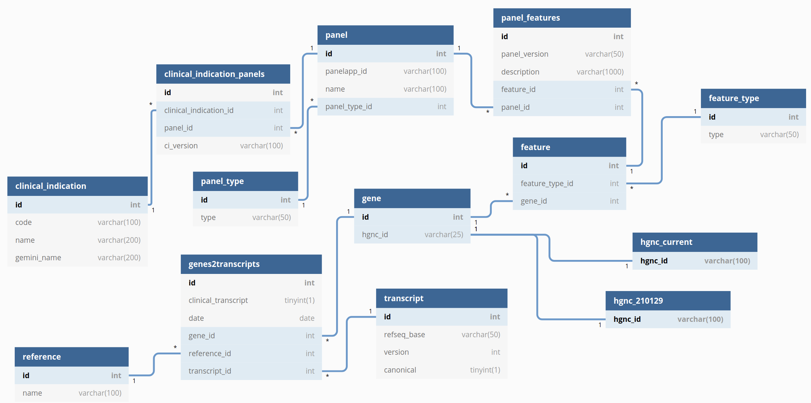

## What does this do?

Handles operations with the panel_database.

## What are typical use cases for this?

Generating panelapp dumps, generating django importing dumps, generating sql dumps.

Checking database data, checking tests against Test directory, checking gene transcripts.

## What is required for this to run?

Python > 3.6

Database called panel_database

<p align="center">
    
</p>

From https://github.com/PyMySQL/mysqlclient-python :
>Linux  
Note that this is a basic step. I can not support complete step for build for all environment. If you can see some error, you should fix it by yourself, or ask for support in some user forum. Don't file a issue on the issue tracker.  
You may need to install the Python 3 and MySQL development headers and libraries like so:  
    &nbsp;&nbsp;&nbsp;&nbsp;$ sudo apt-get install python3-dev default-libmysqlclient-dev build-essential # Debian / Ubuntu  
    &nbsp;&nbsp;&nbsp;&nbsp;% sudo yum install python3-devel mysql-devel # Red Hat / CentOS

Python packages specified in the requirements.txt

Usage:

```python3
source /panels/panel_env/bin/activate

# output all panelapp panels in folder ${day}_panelapp_dump
python main.py generate -all National_test_directory.xls
# output gms panelapp panels in folder ${day}_panelapp_dump
python main.py generate -gms National_test_directory.xls

# output django_fixtures/${day}/${day}_${table_name}.json and django_fixtures/${day}/${day}_json_dump.json
python main.py generate -j 201020_panelapp_dump National_test_directory.xls 

# output sql_dump/${day}_genepanels.tsv
python main.py generate -g National_test_directory.xls
# output sql_dump/${day}_gemini_names.txt
python main.py generate -gd National_test_directory.xls
# output sql_dump/${day}_genepanels.txt
python main.py generate -gp National_test_directory.xls
# output sql_dump/${day}_sample2genes.tsv
python main.py generate -m gemini_dump National_test_directory.xls

# check db structure against panelapp dump
python main.py check panelapp_dump 201020_panelapp_dump National_test_directory.xls

# import the data in the database
python main.py mod_db -i django_fixtures/${day}/${day}_json_dump.json
```

## What does this output?

Panelapp dump of the day, django fixtures, sql dumps...

### This was made by EMEE GLH
